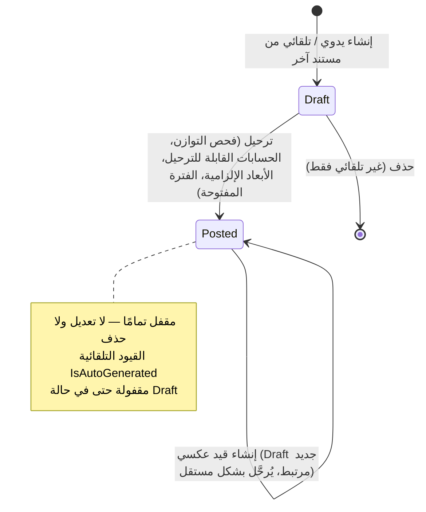
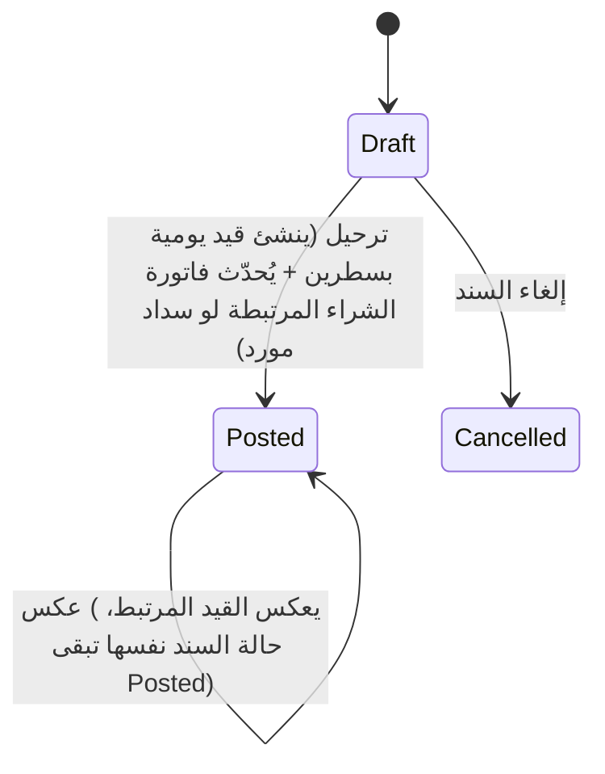
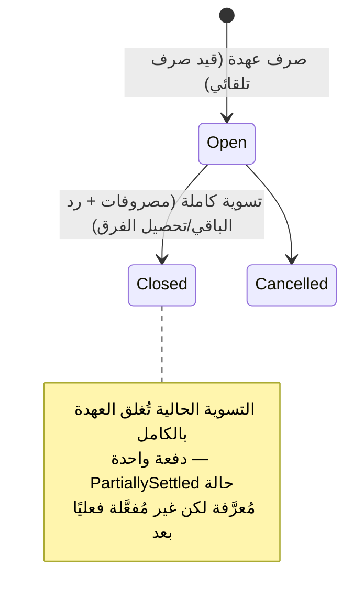
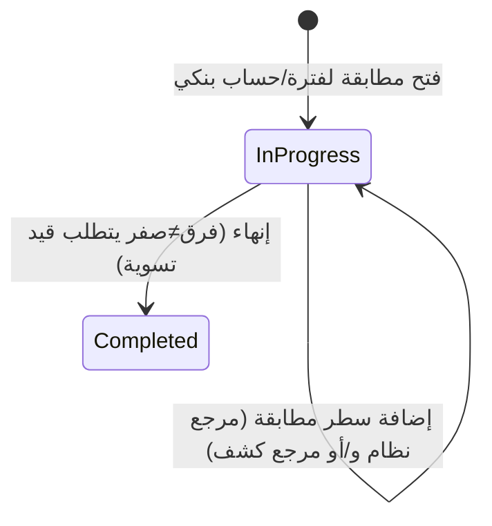
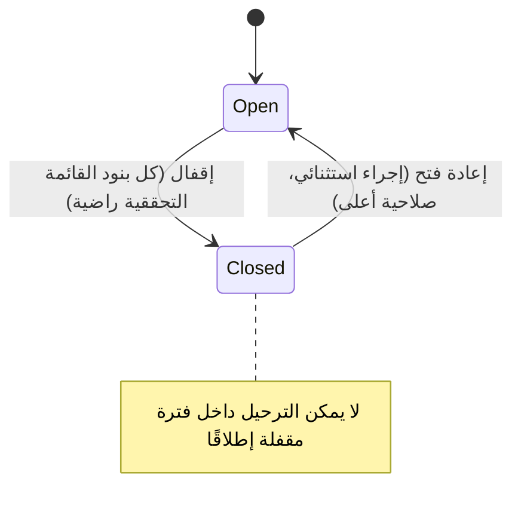

# موديول الحسابات العامة (Accounting Module)

> **حالة الاختبار: ✅ مكتمل ومُختبر.** تقرير مبني بالكامل على الكود الفعلي في `D:\Projects\ALHabbak`.

---

## 1. نظرة عامة على الموديول

**الهدف**: إدارة الدورة المحاسبية الكاملة — دليل حسابات، قيود يومية، سندات، عهد، مطابقات خزينة/بنك، فترات مالية.

| المقياس | العدد |
|---|---|
| الشاشات المتاحة من قائمة الحسابات (List+Edit منفردة) | **15 شاشة** (~25 ملف صفحة، منها 4 شاشات هجينة List+Detail في ملف واحد) |
| قواعد العمل الموثّقة برقم في الكود | **~30 قاعدة** (رُقّمت 1–30، مع كون 13/15/26 تخص موديولات أخرى) |
| Controllers الخاصة بالموديول | **14** تحت `Controllers/Accounting/` + استخدام مشترك لـ `CodingRulesController`/`AttachmentsController` |
| حالة الاختبار | ✅ مُختبر بالكامل (Backend + حي في المتصفح طوال جلسات العمل) |

---

## 2. الكيانات (Entities)

| الكيان | الملف | الحقول الرئيسية |
|---|---|---|
| **Account** | `src/Habbak.ERP.Domain/Accounting/Account.cs` | Code, NameAr/En, ParentId, Level, AccountType, Nature, IsPostable, CurrencyCode, IsActive, IsSharedAcrossCompanies |
| **CostCenterDimension** ("مركز التكلفة") | `.../CostCenterDimension.cs` | Code, NameAr/En, LinkedEntityType (None/Branch), Values |
| **CostCenterDimensionValue** | `.../CostCenterDimensionValue.cs` | Code, NameAr/En, ParentId, Level, IsActive |
| **AccountDimensionLink** | `.../AccountDimensionLink.cs` | AccountId, CostCenterDimensionId, DisplayOrder, IsMandatory (حد أقصى 5/حساب) |
| **JournalEntry** | `.../JournalEntry.cs` | EntryNumber, EntryDate, Description, SourceModule, SourceDocumentType/Id (متعدد الأشكال)، Status، IsAutoGenerated، ReversalOfEntryId، TotalDebit/Credit، PostedAtUtc/By |
| **JournalEntryLine** | `.../JournalEntryLine.cs` | AccountId, DebitAmount, CreditAmount, CurrencyCode, ExchangeRate، DimensionValues |
| **JournalEntryLineDimensionValue** | `.../JournalEntryLineDimensionValue.cs` | CostCenterDimensionId, CostCenterDimensionValueId |
| **Voucher** (سندات القبض/الصرف) | `.../Voucher.cs` | VoucherType, VoucherNumber, TreasuryAccountId, CounterpartyType/Id, DirectAccountId, Amount, RelatedInvoiceId, Status, JournalEntryId |
| **CustodyRegister** | `.../CustodyRegister.cs` | EmployeeId, Amount, IssueDate, Status, JournalEntryId, Settlements |
| **CustodySettlement + CustodySettlementLine** | `.../CustodySettlement.cs` | SettlementDate, RemainingAmount؛ سطور: AccountId, Amount, Description |
| **CashReconciliation** | `.../CashReconciliation.cs` | TreasuryAccountId, ReconciliationDate, ExpectedBalance (محسوب تلقائيًا)، ActualBalance، DifferenceAmount/Reason، ApprovedByUserId/At، Denominations |
| **BankReconciliationRun + BankReconciliationLine** | `.../BankReconciliationRun.cs` | BankAccountId, PeriodFrom/To, Status، AdjustmentJournalEntryId؛ سطور: SystemTransactionType/Id, BankStatementLineId, MatchedAmount, IsAutoMatched |
| **AccountingPeriod + PeriodCloseChecklistItem** | `.../AccountingPeriod.cs` | PeriodStart/End, Status, ClosedByUserId/At؛ Checklist: ItemKey, IsSatisfied |
| **CodingRule** (مشترك) | `src/Habbak.ERP.Domain/Common/CodingRule.cs` | ScreenCode, IsAutomatic, Format, Prefix, SequenceLength, IsAttachmentMandatory, IsDescriptionMandatory |
| **TreasuryTransfer** | `.../TreasuryTransfer.cs` | FromTreasuryAccountId, ToTreasuryAccountId, Amount, TransferDate, Status, JournalEntryId |
| **PaymentMethod** | `.../PaymentMethod.cs` | Code, NameAr/En, IsActive |
| **AccountOpeningBalanceBatch + Line** | `.../AccountOpeningBalanceBatch.cs` | BatchNumber, TransactionDate, Status, JournalEntryId؛ سطور: AccountId, Amount |

**Company / Currency**: موجودان فعليًا تحت `src/Habbak.ERP.Domain/Organization/` (`Company.cs`, `Currency.cs`) — يظهران في قائمة الحسابات الجانبية لكنهما كيانات تنظيمية عامة وليست حسابية بحتة.

---

## 3. الشاشات (Screens)

| الشاشة | النوع | الحقول الرئيسية | الأزرار الرئيسية | القيود |
|---|---|---|---|---|
| دليل الحسابات | List+Detail هجين | Code, Name, Parent, Type, Nature, IsPostable | حفظ، حساب جديد، استيراد Excel، حذف | تعديل النوع/الطبيعة أو IsPostable بعد وجود حركات مرحّلة يحتاج موافقة (غير مبني بعد) — يُرفض تمامًا. حد أقصى 5 أبعاد لكل حساب. |
| مراكز التكلفة وقيمها | List + Edit | Code, Name, LinkedEntityType, Values | حفظ، رجوع، حذف | لو مرتبط بالفروع، قائمة القيم تُقرأ حيًا من شاشة الفروع (Read-only). |
| القيود اليومية | List + Edit | EntryNumber, Date, Description, Lines (حساب/مدين/دائن/عملة/أبعاد) | ترحيل أو حفظ، إلغاء/رجوع، مرفقات، إنشاء قيد عكسي، حذف | يُقفل تمامًا بعد الترحيل (عكس فقط). القيود التلقائية مقفولة نهائيًا (لا تعديل ولا حذف أبدًا). |
| سندات القبض/الصرف | List + Edit | VoucherNumber, Date, TreasuryAccount, Counterparty, Amount | ترحيل أو حفظ، إلغاء/رجوع، مرفقات، عكس، إلغاء السند | يُقفل بعد الترحيل. المبلغ صفر مرفوض. حساب مباشر إلزامي فقط لو النوع "آخر". |
| تحويلات الخزائن/البنوك | List + Edit | FromAccount, ToAccount, Amount, TransferDate | ترحيل أو حفظ، إلغاء/رجوع، مرفقات | يُقفل بعد الترحيل. المبلغ صفر مرفوض. |
| تسجيل العهد وتسويتها | List+Detail هجين | إصدار: موظف، مبلغ، تاريخ، حسابات؛ تسوية: بنود مصروفات | صرف عهدة، تسوية العهدة، + بند | إجمالي التسوية لا يتجاوز مبلغ العهدة الأصلي. التسوية الحالية تُغلق العهدة بالكامل دفعة واحدة (لا تسوية جزئية تراكمية فعليًا حتى الآن). |
| مطابقة الخزينة اليومية | List+Detail هجين | TreasuryAccount, ReconciliationDate, ExpectedBalance (تلقائي)، ActualBalance، Denominations | + مطابقة، اعتماد المطابقة | لازم اعتماد صريح حتى لو الفرق صفر. لا يمكن الاعتماد لو فيه سندات مسودة بنفس الخزينة/اليوم. |
| مطابقة البنك | List+Detail هجين | BankAccount, PeriodFrom/To, Lines (نوع الحركة/مرجع النظام/مرجع الكشف/المبلغ) | + فتح مطابقة، + سطر، إنهاء المطابقة | إنهاء بفرق ≠ صفر يتطلب حساب تسوية وينشئ قيد تلقائي. لا استيراد آلي لكشف البنك حاليًا — إدخال يدوي فقط. |
| الفترات المالية | List + Edit | PeriodStart/End, Status, Checklist حي | حفظ (إنشاء فقط)، إقفال الفترة، إعادة فتح | كل بند Checklist لازم يتحقق لحظة الإقفال فعليًا (مش قيمة مخزّنة قديمة). |
| أرصدة افتتاحية للحسابات | List + Edit | BatchNumber, TransactionDate, Lines (حساب/مبلغ) | حفظ، ترحيل، إلغاء (مسودة فقط) | فحص توازن قبل الترحيل. الترحيل نهائي. |
| طرق الدفع | List + Edit | Code, Name, IsActive | حفظ، رجوع، حذف | شاشة Lookup بسيطة، جدول مستقل خاص بها. |
| التقارير | مخصّصة (13 تقرير) | — | تشغيل + تصدير لكل تقرير | راجع القسم 4. |
| الفروع / الشركات / العملات | List + Edit (تنظيمية) | Code, Name, IsActive (+حقول إضافية للشركة: السجل التجاري، البطاقة الضريبية، العملة الأساسية) | حفظ، رجوع، حذف | متاحة من قائمة الحسابات الجانبية رغم كونها تنظيمية عامة. |

---

## 4. التقارير (Reports)

**13 تقريرًا فعليًا في `ReportsPage.tsx`، كلها بزر تصدير (Excel/CSV/PDF/طباعة):**

**الثمانية الأساسية (مطابقة لما طلبته الملاحظات):**
1. ميزان المراجعة (أرصدة كل الحسابات حتى تاريخ)
2. دفتر اليومية (كل القيود خلال فترة، فلتر بالحالة)
3. دفتر الأستاذ العام (كشف حساب واحد بالرصيد التراكمي)
4. الميزانية العمومية (أصول/خصوم/حقوق ملكية حتى تاريخ)
5. قائمة الدخل (إيرادات/مصروفات خلال فترة)
6. تقرير الخزائن والبنوك (كشف حركات لكل خزينة/بنك خلال فترة)
7. تقرير العهد (كل العهد وتسوياتها)
8. تقرير مطابقة البنك (الحركات المطابقة لحساب بنكي خلال فترة)

**تقارير إضافية موجودة (زيادة عن المطلوب):**
9. كشف حساب خزينة (نفس مكوّن دفتر الأستاذ، لحساب خزينة واحد)
10. قائمة التدفقات النقدية (مبسّطة، لحسابات مختارة)
11. كشف حساب مركز تكلفة
12. موقف الخزائن والبنوك (لحظة رصيد وليس حركات)
13. المصروفات حسب مركز التكلفة

**غير متاحة بعد (Placeholder معطّل)**: أعمار ديون العملاء، أعمار ديون الموردين، كشف حساب مورد، كشف حساب عميل (تحتاج موديول المبيعات/العملاء غير المبني بعد).

---

## 5. الدورة المستندية (Document Cycle)

### دورة القيد اليومي

### دورة السند (قبض/صرف)

### دورة العهدة

### دورة مطابقة البنك

### دورة إقفال الفترة المالية

---

## 6. قواعد العمل (Business Rules)

| # | القاعدة | مكان التنفيذ |
|---|---|---|
| 1 | القيد لازم يكون متوازن (مدين = دائن) وقت الترحيل | `PostingService.cs` |
| 2 | الحسابات التجميعية/غير القابلة للترحيل لا تقبل قيود مباشرة | `PostingService.cs` |
| 3 | كل بُعد إلزامي على الحساب لازم له قيمة على السطر المُرحَّل | `PostingService.cs` |
| 4 | القيود التلقائية لا تُعدَّل/تُحذف أبدًا؛ القيد المرحَّل يُعكس لا يُحذف | `JournalEntry.cs`, `DeleteJournalEntryCommand.cs` |
| 5 | ذرّية: القيد التلقائي المصاحب لمستند يُنشأ في نفس عملية الحفظ مع تحديث حالة المستند | `PostVoucherCommand.cs` وأشباهها |
| 6 | تسوية العهدة تتطلب توزيعًا كاملاً على حسابات المصروفات | `CreateCustodySettlementCommand.cs` |
| 7 | إنهاء مطابقة بنكية بفرق ≠ صفر يتطلب قيد تسوية إلزاميًا | `CompleteBankReconciliationCommand.cs` |
| 8 | كل بند في قائمة إقفال الفترة يُتحقّق منه حيًا لحظة الإقفال | `ClosePeriodCommand.cs`, `PeriodChecklistEvaluator.cs` |
| 9 | لا ترحيل داخل فترة مالية مقفلة | `PostingService.cs` |
| 10 | إعادة فتح فترة مقفلة إجراء استثنائي بصلاحية أعلى، ويُدقَّق دائمًا | `ReopenPeriodCommand.cs` |
| 11 | الترحيل قد يتحول لمسودة بانتظار موافقة بدل الترحيل المباشر | `PostingService.cs` (FinalizePostingAsync) |
| 12 | الحساب المشترك بين الشركات يبقى تعريفًا فقط — الأرصدة منفصلة تمامًا لكل شركة | `Account.cs`, `CreateAccountCommand.cs` |
| 14 | أعمدة الأبعاد في شاشة القيد ديناميكية حسب الحساب المختار، حتى 5 أعمدة | `JournalEntryEditPage.tsx` |
| 16 | زر "إنشاء قيد عكسي" ينشئ مسودة معكوسة مرتبطة، تُرحَّل كخطوة منفصلة | `ReverseJournalEntryCommand.cs` |
| 17 | لا يوجد سند/تحويل بمبلغ صفر | `CreateVoucherCommand.cs`, `CreateTreasuryTransferCommand.cs` |
| 18 | لا اعتماد لمطابقة خزينة لو فيه سندات مسودة بنفس الخزينة/اليوم | `ApproveCashReconciliationCommand.cs` |
| 19 | مطابقة الخزينة تتطلب اعتمادًا صريحًا حتى لو الفرق صفر | `ApproveCashReconciliationCommand.cs` |
| 20 | تغيير نوع/طبيعة الحساب أو IsPostable بعد وجود حركات مرحّلة يحتاج موافقة (غير مبنية) — يُرفض | `UpdateAccountCommand.cs` |
| 21 | قيمة البُعد على السطر لازم تنتمي فعليًا للبُعد المُعرَّف عليه | `PostingService.cs` |
| 22 | إجمالي بنود تسوية العهدة لا يتجاوز مبلغ العهدة الأصلي | `CreateCustodySettlementCommand.cs` |
| 23 | سطر مطابقة البنك لازم مرجع نظام و/أو مرجع كشف — مش لا هذا ولا ذاك | `AddBankReconciliationLineCommand.cs` |
| 24 | حد أقصى 5 روابط أبعاد تحليلية لكل حساب | `CreateAccountDimensionLinkCommand.cs` |
| 25 | الفرع على القيد/العهدة عمود مباشر، لا يُستنتج من بُعد تحليلي | `JournalEntry.cs`, `CustodyRegister.cs` |
| 27 | توزيع مصروف على أكثر من مركز تكلفة يتم بأسطر متعددة لنفس الحساب — لا جدول توزيع نسب منفصل | `JournalEntryLine.cs` |
| 28 | حساب السند المباشر إلزامي فقط لو نوع الطرف الآخر "آخر" | `Voucher.cs`, `CreateVoucherCommand.cs` |
| 29 | كود محجوز `COST_CENTER` لبُعد مركز التكلفة المزروع بالنظام | `CostCenterDimension.cs` |
| 30 | مجموعة ثابتة من بنود قائمة إقفال الفترة (قيود/سندات/تحويلات غير مرحّلة، مطابقة خزينة/بنك، فواتير ETA) | `Enums.cs`, `PeriodChecklistEvaluator.cs` |

> **TBD**: القواعد 13/15/26 في نفس التسلسل الرقمي وُجدت فقط في كود المخازن/المشتريات — يحتاج تأكيد إن كانت لا تخص الحسابات أصلاً أو أُعيد ترقيمها في المستند المرجعي `01-Module-Accounting.md`.

---

## 7. الـ API

| Controller | أهم الـ Endpoints |
|---|---|
| `AccountsController` (`accounting/accounts`) | GET / (بحث)، GET /tree، GET/POST/PUT/DELETE /{id} |
| `AccountOpeningBalancesController` | GET/POST /، GET/PUT /{id}، POST /{id}/post، POST /{id}/cancel |
| `AccountingPeriodsController` | GET/POST /، POST /{id}/close، POST /{id}/reopen |
| `BankReconciliationsController` | GET/POST /، POST /{id}/lines، POST /{id}/complete |
| `CashReconciliationsController` | GET/POST /، POST /{id}/approve |
| `CustodyRegistersController` | GET/POST /، POST /{id}/settlements |
| `DimensionsController` | GET/POST/PUT/DELETE / و /values و /links |
| `JournalEntriesController` | GET/POST/PUT/DELETE /، POST /{id}/post، POST /{id}/reverse |
| `PaymentMethodsController` | GET/POST/PUT/DELETE / |
| `ReceiptVouchersController` / `PaymentVouchersController` (Base مشترك) | GET/POST/PUT /، POST /{id}/post، /cancel، /reverse |
| `ReportsController` | 12 مسار GET — واحد لكل تقرير (trial-balance، account-statement، income-statement، balance-sheet، cash-flow، treasury-position، cost-center-statement، expenses-by-cost-center، journal-book، treasury-bank-statement، custody-report، bank-reconciliation-report) |
| `TreasuryTransfersController` | GET/POST/PUT /، POST /{id}/post |
| `CodingRulesController` (مشترك) | GET /?lang=، GET/PUT /{screenCode} |
| `AttachmentsController` (مشترك) | GET /?entityType=&entityId=، POST /، GET /{id}/content، DELETE /{id} |
