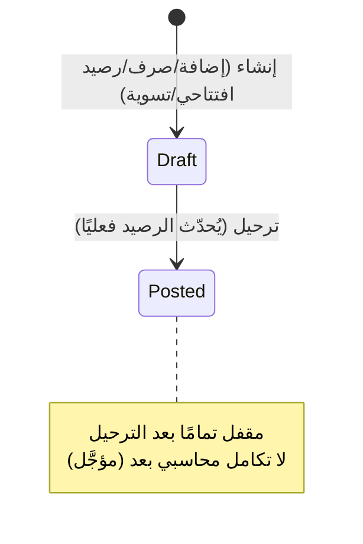
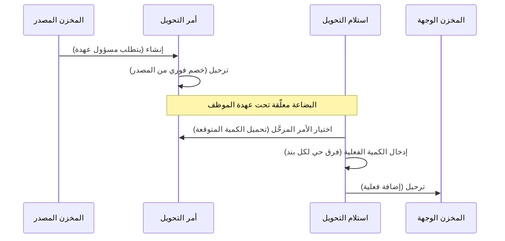
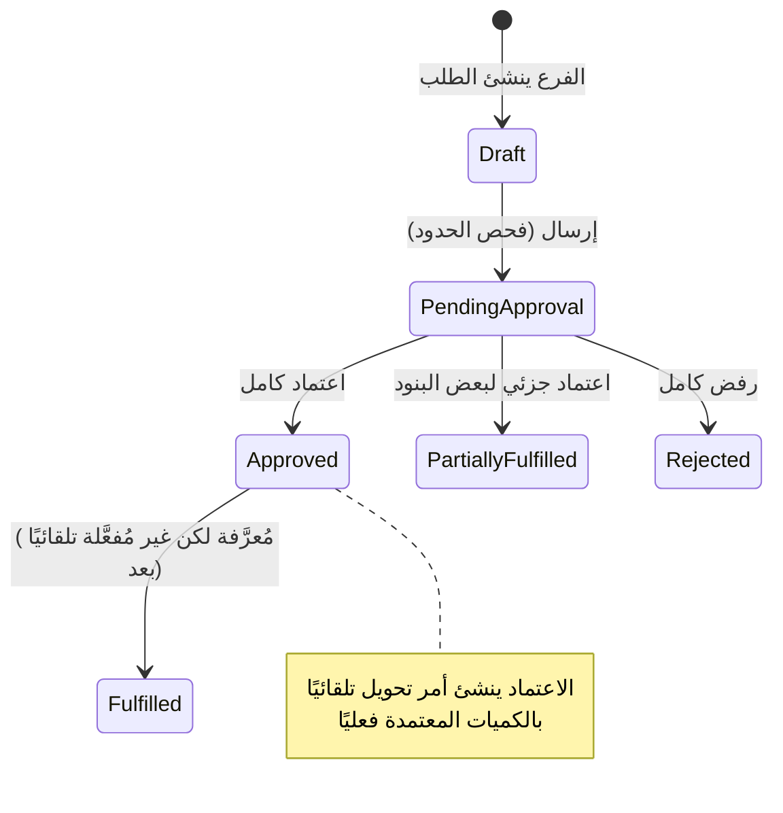
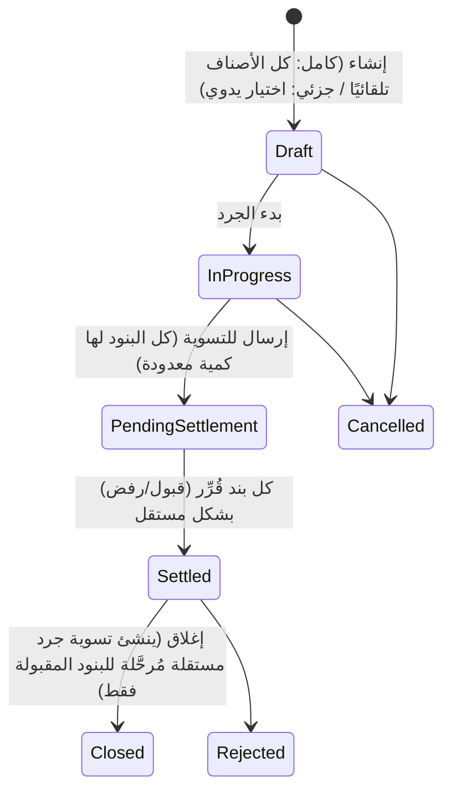
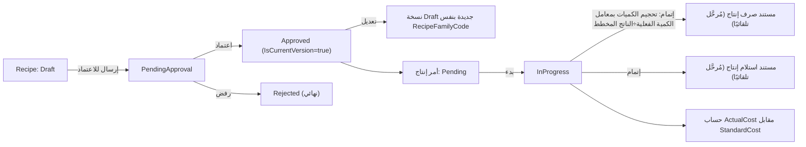

# موديول المخازن والتصنيع (Inventory &amp; Manufacturing Module)

> **حالة الاختبار: ✅ مكتمل ومُختبر.** تقرير مبني بالكامل على الكود الفعلي في `D:\Projects\ALHabbak`.

---

## 1. نظرة عامة على الموديول

**الهدف**: إدارة الأصناف والمخازن والحركة المخزنية، تحويلات الفروع، الجرد الدوري، والتصنيع (وصفات + أوامر إنتاج).

| المقياس | العدد |
|---|---|
| شاشات الموديول (حسب ترقيم المستند المرجعي) | **23 شاشة** (تُغطّى بـ 33 ملف Frontend — بعض الشاشات تتشارك مكوّنًا واحدًا بمعامل `kind`) |
| قواعد العمل الموثّقة في المستند المرجعي | **38 قاعدة**، منها **33 قاعدة** مُشار لرقمها صراحة في الكود |
| Controllers | **23 ملف** (21 Controller فعلي + 2 Base مشتركة) |
| حالة الاختبار | ✅ مُختبر بالكامل |

---

## 2. الكيانات (Entities)

جميعها تحت `src/Habbak.ERP.Domain/Inventory/`:

| الكيان | الحقول الرئيسية |
|---|---|
| **Item** | Code, NameAr/En, ItemGroupId, POSCategoryId (اختياري)، ItemType، Barcode، وحدات القياس (أساسية/شراء/بيع)، SaleMethod، CostMethod، DefaultPrice، IsStocked، **IsTracked** (يفرض رقم التشغيلة)، TrackSerial، **ShelfLifeDays** (مدة الصلاحية بالأيام)، StandardCost، Is Purchasable/Sellable/Manufacturable، AllowSubstitutes، Status |
| **ItemGroup** | Code, NameAr/En, ParentId (هرمي)، IsActive |
| **UnitOfMeasure** | Code, NameAr/En, Category (وزن/حجم/عدد)، IsActive |
| **POSCategory** | Code, NameAr/En, DisplayOrder, IsActive |
| **Warehouse** | BranchId (فارغ = رئيسي)، Code, NameAr/En, WarehouseType (رئيسي/مواد فرع/إنتاج/مرتجعات تالفة/تام الصنع)، AllowNegativeBalance، IsActive |
| **StockBalance** | ItemId, WarehouseId, QuantityOnHand (لا يقل عن صفر إلا بإذن) |
| **StockTransaction** | WarehouseId, ItemId, TransactionType, Quantity, UnitCost, TransactionDate, ExpiryDate، SourceDocumentType/Id (متعدد الأشكال)، BatchNumber، JournalEntryId |
| **WarehouseDocument** (+سطور) | مستند متعدد الأشكال عبر `DocumentType`: StockIn/StockOut/TransferOrder/TransferReceipt/InventoryAdjustment/ProductionIssue/ProductionReceipt/OpeningBalance — Header: SourceWarehouseId/DestinationWarehouseId، RelatedWarehouseDocumentId (للربط استلام↔أمر تحويل)، CustodyOfficerId، Status، JournalEntryId |
| **CustodyOfficer** | BranchId, Code, NameAr/En, IsActive (كيان مستقل بانتظار موديول الموارد البشرية) |
| **BranchRequest** (+سطور) + **BranchItemLimit** | BranchId, RequestNumber, Status؛ سطر: ItemId, RequestedQuantity, ApprovedQuantity؛ الحدود: MinRequestQuantity/MaxRequestQuantity لكل فرع/صنف |
| **InventoryCount** (+سطور) | WarehouseId, CountNumber, CountType (كامل/جزئي/مفاجئ/دوري)، Status (Draft→InProgress→PendingSettlement→Settled→Closed)؛ سطر: SystemQuantity، CountedQuantity، VarianceQuantity، SettlementDecision لكل سطر |
| **Recipe** (+سطور) | RecipeFamilyCode، VersionNumber، PreviousVersionId، IsCurrentVersion، OutputItemId (لازم نصف مصنّع/تام)، OutputQuantity، WastePercentage، Status؛ سطر: ComponentItemId (قد يكون ناتج وصفة أخرى — BOM متعدد المستويات) |
| **ProductionOrder** | WarehouseId, RecipeId (نسخة محددة)، PlannedQuantity، ActualQuantity، Status، StandardCost، ActualCost (يُحسب عند الإتمام فقط)، روابط لمستندي الصرف/الاستلام الناتجين |
| **WasteRecord** | WarehouseId, ItemId, Quantity, WasteDate, Reason, SourceDocumentType (ProductionOrder/POSRealtimeLoss/Manual) |
| **ShortagePolicy / InventorySettings** | AllowOverrideOnShortage، RequiresApprovalForOverride، SlowMovingThresholdDays (افتراضي 90) |
| **ProductionSalesModeSetting** | ScopeType (شركة/فرع/POS/صنف — أولوية صنف>POS>فرع>شركة)، Mode (لحظي/مخزون) |

**تتبّع الصلاحية**: لا يوجد حقل `IsExpiryTracked` منفصل — يعمل `Item.IsTracked` (يفرض رقم التشغيلة) مع `ShelfLifeDays` معًا، وتاريخ الانتهاء يُحسب تلقائيًا على `StockTransaction`/`WarehouseDocumentLine` (قابل للتعديل يدويًا).

---

## 3. الشاشات (23 شاشة)

### بيانات أساسية
| الشاشة | الحقول | الملاحظات |
|---|---|---|
| الأصناف | Code, Name, Group, POSCategory, ItemType, وحدات القياس، IsStocked/IsTracked/ShelfLifeDays، StandardCost + أقسام فرعية (تحويلات وحدات، إعدادات مخزن، حدود فرع) | الأقسام الفرعية لا تُحرَّر إلا بعد حفظ الصنف |
| مجموعات الأصناف | Code, Name, Parent, IsActive | هرمية |
| تصنيفات نقطة البيع | Code, Name, DisplayOrder | منفصلة عن مجموعات الأصناف — لتبويبات شاشة POS فقط |
| وحدات القياس | Code, Name, Category | Category معلوماتي فقط |
| المخازن | Code, Name, WarehouseType, Branch (شرطي)، AllowNegativeBalance | |
| مسؤولو العهد | Code, Name, Branch, IsActive | كيان مستقل بانتظار موديول HR |

### المستندات
| الشاشة | النوع | الملاحظات |
|---|---|---|
| أرصدة افتتاحية / إذن إضافة / إذن صرف / أمر تحويل / تسوية جرد مستقلة | List+Edit (مكوّن واحد بمعامل `kind`) | Draft→Posted، لا تعديل بعد الترحيل |
| استلام تحويل | تفاعلية | تحمّل بنود أمر التحويل كـ"كمية متوقعة" للقراءة، وتحسب الفرق حيًا لكل سطر |
| طلبات توريد الفروع | List+Edit | فحص حدود الطلب (أدنى/أقصى) يتم عند الإرسال للاعتماد |
| اعتماد طلبات توريد الفروع | تفاعلية | تحديد الكمية المعتمدة لكل سطر (قد تقل عن المطلوب)، اختيار المخزن المصدر والعهدة، ينشئ أمر تحويل تلقائيًا |

### الجرد
| الشاشة | النوع | الملاحظات |
|---|---|---|
| دورة الجرد | تفاعلية متعددة المراحل (صفحة واحدة تتغير حسب الحالة) | Draft→InProgress→PendingSettlement→Settled→Closed؛ الإغلاق يُنشئ تسوية جرد مستقلة تلقائيًا للبنود المعتمدة فقط |

### التصنيع
| الشاشة | النوع | الملاحظات |
|---|---|---|
| الوصفات | List+Edit (تدمج التعريف والاعتماد) | Draft→PendingApproval→Approved/Rejected؛ تعديل وصفة معتمدة ينشئ نسخة جديدة بدل تعديل القديمة |
| أوامر الإنتاج | List+Edit | يبدأ→يكتمل (يُحسب معامل تحجيم بالكمية الفعلية/الناتج المخطط، ويُنشئ مستندي صرف/استلام إنتاج مُرحَّلين تلقائيًا) |
| متابعة الهالك | List+Edit | التسجيل اليدوي فقط قابل للتعديل (والتاريخ/السبب فقط)؛ التلقائي (من أمر إنتاج) للقراءة فقط |
| صرف/استلام الإنتاج | قراءة فقط | تُنشأ حصريًا عند إتمام أمر إنتاج |

### الإعدادات
| الشاشة | الملاحظات |
|---|---|
| إعدادات نماذج الإنتاج والبيع | أولوية: صنف > نقطة بيع > فرع > شركة |
| سياسة تجاوز الحدود والنقص | صف واحد لكل شركة |
| إعدادات المخزون العامة | حد أيام الصنف الراكد (افتراضي 90) |

---

## 4. التقارير (Reports)

**8 تقارير مُنفَّذة فعليًا** في `InventoryReportsPage.tsx`:
1. حركة صنف — سجل حركات صنف/مخزن خلال فترة
2. تقرير المخزون — الرصيد الحالي والقيمة التقديرية لكل صنف/مخزن
3. الأصناف تحت الحد الأدنى — مع كمية النقص
4. تقرير الجرد — ملخص لكل عملية جرد (عدد البنود/بنود التباين)
5. الحركة اليومية — كل حركات المخزون ليوم محدد
6. استهلاك المواد الخام — كمية/قيمة المستهلك لكل صنف خلال فترة
7. الهالك — سجلات الهالك بالقيمة والسبب
8. تحويلات المخزون — مستندات التحويل خلال فترة

**⚠️ ملاحظة**: المستند المرجعي (`02-Module-Inventory-Manufacturing.md`, قسم 8) يذكر **17 تقريرًا** إجمالاً (منها: كارت الصنف، تحليل ABC، تقرير التشغيلات، طلبات التوريد المعلّقة، تكلفة الوصفات، مقارنة التكلفة المعيارية بالفعلية، ملخص أوامر الإنتاج) — **9 تقارير إضافية موثّقة لكن غير منفَّذة بعد**.

---

## 5. الدورة المستندية (Document Cycle)

### دورة الإضافة/الصرف

### دورة التحويل بين المخازن

### دورة طلبات توريد الفروع

### دورة الجرد الكاملة

### دورة الوصفات وأوامر الإنتاج

---

## 6. قواعد العمل (Business Rules)

| # | القاعدة | مكان التنفيذ |
|---|---|---|
| 1 | لا حركة صرف تنقص رصيد الصنف عن صفر إلا بتجاوز مصرَّح به أو إعداد "سماح برصيد سالب" على المخزن | `StockBalance.cs`, `Warehouse.cs` |
| 3 | ترحيل مستند المخزن ينشئ حركة المخزون (والقيد المحاسبي لاحقًا) بشكل ذرّي | `PostWarehouseDocumentCommand.cs` |
| 4 | كمية طلب الفرع لا تتجاوز الحد الأقصى المسموح إلا بتجاوز مصرَّح | `BranchRequestLine.cs`, `ShortagePolicy.cs` |
| 5 | الفرع لا يطلب من فرع آخر مباشرة — دائمًا من مخزن رئيسي | `BranchRequest.cs` |
| 6 | اعتماد طلب الفرع (كليًا/جزئيًا) ينشئ أمر تحويل تلقائيًا | `BranchRequest.cs`, `BranchRequestLine.cs` |
| 7 | أي فرق كمية عند استلام التحويل يُسجَّل صراحة، ويُحسب حيًا | `WarehouseDocumentLine.cs`, أوامر إنشاء/تحديث استلام التحويل |
| 8 | الأصناف المتتبَّعة (IsTracked) تفرض رقم تشغيلة على كل حركة | `Item.cs`, `StockTransaction.cs`, `WarehouseDocumentLine.cs` |
| 9 | الجرد الكامل يُنشئ بنودًا لكل الأصناف الفعّالة تلقائيًا؛ الجزئي/الدوري يدوي | `CreateInventoryCountCommand.cs` |
| 10 | تسوية تباين الجرد قرار مستقل لكل بند | `SettleInventoryCountLineCommand.cs` |
| 11 | إغلاق الجرد يُنشئ تسوية مستقلة تلقائيًا للبنود المقبولة فقط | `CloseInventoryCountCommand.cs` |
| 13 | الوصفات تدعم مكوّنات متعددة المستويات، مع رفض أي دورة مرجعية | `RecipeCycleChecker.cs` |
| 15 | إتمام أمر الإنتاج يُحجّم كميات الوصفة بمعامل (الكمية الفعلية÷الناتج المخطط) | `CreateProductionOrderCommand.cs` |
| 16 | فرق التكلفة (معياري مقابل فعلي) يُحسب وقت الإتمام | `CreateProductionOrderCommand.cs` |
| 17 | إعداد نموذج الإنتاج/البيع يُحلّ بأولوية: صنف > نقطة بيع > فرع > شركة | `GetProductionSalesModeSettingsListQuery.cs` |
| 18 | النموذج اللحظي يمنع البيع لو أي مكوّن ناقص؛ نموذج المخزون يفحص الصنف التام فقط | `Enums.cs` (ProductionSalesMode) |
| 19 | هالك تتجاوز قيمته حدًا معينًا يتطلب سلسلة اعتماد | `WasteRecord.cs` |
| 20 | رفض أي سلسلة اعتماد نهائي — لا إعادة تقديم | `Enums.cs` (RecipeStatus, InventoryCountStatus) |
| 21 | حدود الحد الأدنى/الأقصى للمخزون لكل صنف/مخزن، وليست قيمة عامة واحدة | `ItemWarehouseSettings.cs` |
| 24 | حقل الفرع على المخزن عمود مباشر (فارغ = رئيسي) | `Warehouse.cs` |
| 26 | الأصناف غير الفعّالة تختفي من قوائم الاختيار الجديدة لكن تبقى ظاهرة في المستندات التاريخية | `Enums.cs` (ItemStatus) |
| 27 | صنف من نوع "مادة خام" لا يمكن أن يكون ناتج وصفة | `Recipe.cs` |
| 28 | رصيد المخزون ودفتره دائمًا بوحدة القياس الأساسية للصنف | `Item.cs`, `StockBalance.cs` |
| 29 | "الحدود الخمسة" موزّعة على كيانين منفصلين (3 حدود مخزون + حدّا طلب فرع) | `Item.cs`, `BranchItemLimit.cs` |
| 30 | أمر التحويل يتطلب مسؤول عهدة إلزاميًا للترحيل | `WarehouseDocument.cs` |
| 31 | تعديل وصفة معتمدة يُنشئ نسخة جديدة بدل التعديل المباشر | `ApproveRecipeCommand.cs`, `UpdateRecipeCommand.cs` |
| 32 | معامل تحويل الوحدة = عدد الوحدات الأساسية لكل وحدة بديلة واحدة | `ItemUnitConversion.cs` |
| 33 | صلاحية موحّدة واحدة (`OverrideShortage`) لتجاوز القاعدتين 1 و4 | `ShortagePolicy.cs` |
| 34 | مسؤول العهدة يُنسخ تلقائيًا من أمر التحويل لاستلامه | `CreateTransferReceiptCommand.cs` |
| 35 | التكلفة الفعلية لأمر الإنتاج تُحسب فقط عند الإتمام | `ProductionOrder.cs` |
| 36 | تقرير الأصناف الراكدة يعتمد حصريًا على إعداد "حد الأيام" (افتراضي 90) | `GetInventorySettingsQuery.cs` |
| 37 | استلام التحويل لا يُرحَّل بدون أمر تحويل مُرحَّل مرتبط صالح | `CreateTransferReceiptCommand.cs` |
| 38 | الصنف بدون تصنيف نقطة بيع لا يظهر أبدًا بشاشة البيع | `Item.cs` |

> **TBD**: القواعد 2، 12، 14، 22، 23، 25 موثّقة بالمستند المرجعي لكن غير مُشار لرقمها صراحة في كود المخازن — بعضها (22: زر "أمر شراء تلقائي" من تقرير الحد الأدنى، عابر لموديول المشتريات؛ 25: ربط CostCenterId بقيد اليومية) على الأرجح مؤجَّل مع تأجيل التكامل المحاسبي نفسه.

---

## 7. الـ API

| المجموعة | Controllers | نمط الـ Endpoints |
|---|---|---|
| بيانات أساسية | ItemsController, ItemGroupsController, POSCategoriesController, UnitsOfMeasureController, WarehousesController, CustodyOfficersController | GET (قائمة/واحد)، POST، PUT، DELETE |
| مستندات المخزون | WarehouseDocumentsControllerBase (مشترك) → StockInController, StockOutController, TransferOrderController, InventoryAdjustmentsController, OpeningBalancesController | GET/POST/PUT + `POST /{id}/post` |
| استلام التحويل | TransferReceiptController | GET، `GET /postable-orders`، POST، PUT، `POST /{id}/post` |
| مستندات الإنتاج | ProductionDocumentsControllerBase → ProductionIssuesController, ProductionReceiptsController | GET فقط (قراءة) |
| طلبات توريد الفروع | BranchRequestsController | GET/POST/PUT + `/submit` + `/approve` |
| الوصفات | RecipesController | GET/POST/PUT + `/submit` + `/approve` + `/reject` + `/new-version` |
| أوامر الإنتاج | ProductionOrdersController | GET/POST/PUT + `/start` + `/complete` + `/cancel` |
| دورة الجرد | InventoryCountsController | GET/POST + `/start` + `/counted-quantities` + `/submit-for-settlement` + `/lines/{id}/settle` + `/complete-settlement` + `/close` + `/reject` + `/cancel` |
| الهالك | WasteRecordsController | GET/POST/PUT |
| الإعدادات | InventorySettingsController | GET/PUT لكل من shortage-policy، inventory-settings، production-sales-mode (+POST/DELETE) |
| التقارير | InventoryReportsController | 8 مسارات GET (راجع القسم 4) |
