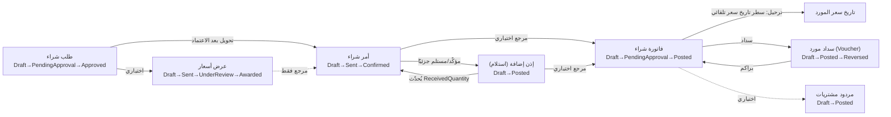

# موديول المشتريات (Purchasing Module)

> **⚠️ حالة الاختبار: مكتمل برمجيًا بالكامل، بانتظار اختبار QA.** تقرير مبني على الكود الفعلي في `D:\Projects\ALHabbak`. أي بند غير مؤكد السلوك موسوم صراحة بـ ⚠️.

---

## 1. نظرة عامة

**الهدف**: إدارة دورة الشراء الكاملة من الطلب الداخلي وحتى السداد، بموردين، عروض أسعار، أوامر شراء، استلام، فواتير، مردودات، وتقييم موردين.

| المقياس | العدد |
|---|---|
| الشاشات | **13 شاشة** (مطابقة لترقيم المستند المرجعي #1–#13) + شاشة تقارير إضافية |
| قواعد العمل الموثّقة برقم في الكود | **11 قاعدة مؤكدة** من أصل 20 موثّقة بالمستند (2, 3, 4, 6, 7, 10, 14, 15, 18, 19, 20) |
| Controllers | **14** تحت `Controllers/Purchasing/` |
| اختبارات آلية | **صفر** — لا يوجد أي ملف اختبار (IntegrationTests أو ApiTests) يشير لأي كيان/أمر/Endpoint في هذا الموديول |

---

## 2. دورة المشتريات القابلة للتخصيص

**الآلية**: `PurchaseCycleSettings.cs` (صف واحد لكل شركة) + شاشة `PurchaseCycleSettingsPage.tsx`، بحقل `CycleType` (enum): **Full، Direct، OrderBased، RequestBased، Simplified**.

**⚠️ اكتشاف مهم**: `CycleType` نفسه **لا يُقرأ في أي Command Handler إطلاقًا** — الأنماط الخمسة موجودة كتسمية وصفية في شاشة الإعدادات فقط، وليست مسارات كود منفصلة فعليًا. السلوك الفعلي يعتمد على مجموعة أعلام منفصلة، منها **3 فقط مُفعَّلة فعليًا**:

| العلم | مُفعَّل؟ | أين |
|---|---|---|
| `RequiresPurchaseRequest` | ✅ نعم | `CreatePurchaseOrderCommand` — يرفض بدون طلب شراء مرتبط |
| `AllowInvoiceWithoutOrder` | ✅ نعم | `CreatePurchaseInvoiceCommand` |
| `RequiresApprovalForInvoice` | ✅ نعم | `PostPurchaseInvoiceCommand` — يمنع الترحيل من مسودة مباشرة |
| `RequiresQuotation` | ❌ لا (تعليق قديم يقول "RFQ غير مبني" رغم إن RFQ موجودة فعليًا الآن) | — |
| `RequiresPurchaseOrder`, `RequiresGoodsReceipt`, `AllowReceiptWithoutInvoice`, `AutoCreateReceiptOnInvoicePost`, `AutoCreateInvoiceOnReceipt`, `RequiresApprovalForPurchaseOrder`, `CapitalizeAdditionalCosts`, `DefaultPaymentTerms` | ❌ لا | غير مقروءة في أي مكان |

**الخلاصة**: تبديل "نمط الدورة" في الواجهة حاليًا **لا يغيّر أي سلوك حقيقي** سوى بوابتين (طلب-يلزم-لأمر، فاتورة-تلزم-لأمر) + اعتماد الفاتورة. هذا أكبر فجوة يستحق تركيز اختبار QA عليها.

---

## 3. الكيانات (Entities)

جميعها تحت `src/Habbak.ERP.Domain/Purchasing/`:

| الكيان | الحقول الرئيسية |
|---|---|
| **Supplier** | Code, NameAr/En, TaxNumber, Phone, Email, PaymentTerms, CreditLimit, CurrencyCode, DefaultWarehouseId, PayableAccountId, ExpenseAccountId, IsActive — بلا RowVersion/حالة (بيانات مرجعية بسيطة) |
| **PurchaseRequest** (+سطور) | RequestNumber, RequestDate, Priority (منخفض/عادي/عالي/عاجل)، Reason, Status, ApprovalInstanceId (⚠️ غير مُستخدم فعليًا) |
| **RFQ** + RFQLine + RFQSupplier + RFQSupplierQuote | RFQNumber, PurchaseRequestId (اختياري)، Status، RequiredDate؛ العرض: UnitPrice, DiscountPercentage, DeliveryDays, ValidUntil, IsSelected — `IsExpired` يُحسب وقت القراءة وليس مخزَّنًا |
| **PurchaseOrder** (+سطور) | OrderNumber, SupplierId, PurchaseRequestId (اختياري)، RFQId/SelectedRFQSupplierQuoteId (⚠️ مُعرَّفة لكن غير موصولة فعليًا)، Currency/ExchangeRate، PaymentTerms، DeliveryTerms، Status، Subtotal/Tax/Total/Discount؛ سطر: ReceivedQuantity، Weight |
| **PurchaseInvoice** (+سطور) | InvoiceNumber, SupplierId, PurchaseOrderId/GoodsReceiptId (اختياريان)، AmountPaid، **AdditionalCosts + AdditionalCostAllocationMethod** (بالقيمة/بالكمية/بالوزن/يدوي)، Commission fields؛ سطر: ReceivedQuantity، AllocatedAdditionalCost، AllocationPercentage، Weight |
| **GoodsReceipt** (+سطور) | WarehouseId, PurchaseOrderId (**إلزامي، لا استلام مستقل**)؛ سطر: Quantity/AcceptedQuantity/RejectedQuantity (لازم تتساوى)، RejectedReason/Warehouse، ExpectedQuantity/VarianceQuantity/Reason، BatchNumber/ExpiryDate، QualityCheckStatus |
| **PurchaseReturn** (+سطور) | SupplierId, PurchaseInvoiceId (اختياري)، WarehouseId (إلزامي)، Reason (7 قيم)، Status |
| **PurchaseExpense** | PurchaseInvoiceId (إلزامي)، ExpenseType (نقل/شحن/جمارك/تحميل/تأمين/أخرى)، Amount, AllocationMethod — بلا حالة/سير عمل |
| **SupplierPriceHistory** | SupplierId, ItemId, UnitPrice, UnitId, EffectiveDate, PurchaseInvoiceId — **يُنشأ تلقائيًا فقط** (سطر واحد لكل بند فاتورة عند الترحيل)، لا إنشاء/تعديل يدوي |
| **SupplierContract** (+ContractItem) | ContractNumber, StartDate/EndDate, AutoRenew, Status (Active فقط قابلة للوصول فعليًا — Expired تحتاج مهمة مجدولة غير موجودة)؛ البند: UnitPrice, Min/MaxQuantity, DiscountPercentage |
| **SupplierEvaluation** | QualityScore, DeliveryTimeScore, QuantityComplianceScore (0–100)، OverallScore (متوسط بسيط) — بلا حالة، سجل تاريخي يُصحَّح مباشرة |
| **SupplierPayment** | **⚠️ ليس كيانًا مستقلاً** — Controller خاص (`SupplierPaymentsController`) يُغلّف كيان `Voucher` المحاسبي نفسه، بـ `VoucherType` مثبَّت على Payment و`CounterpartyType` مثبَّت على Supplier كـ`const` داخل الـ Controller. |

---

## 4. التكامل بين المستندات

**آليتان منفصلتان للربط متعدد الأشكال:**
1. `JournalEntry.SourceDocumentType/Id` — **غير مُستخدمة إطلاقًا في المشتريات** (لا مستند مشتريات ينشئ قيد يومية حتى الآن — التكامل المحاسبي مؤجَّل بالكامل في كل كيانات هذا الموديول).
2. `StockMovementRequest.SourceDocumentType/Id` — هذه الآلية الفعلية المُستخدمة: مُؤكَّدة في `PostGoodsReceiptCommand` (`"GoodsReceipt"`) و`PostPurchaseReturnCommand` (`"PurchaseReturn"`)، تُمرَّر لـ `IStockMovementService` وتُعلِّم كل `StockTransaction` بمصدرها.

**النسخ التلقائي بين المستندات (روابط FK مباشرة):**
- **طلب شراء → أمر شراء**: يتطلب حالة الطلب "معتمد"، وعند النجاح يُحوَّل الطلب لحالة "مُحوَّل" — لا نسخ تلقائي للبنود من الـ Backend (الواجهة الأمامية مسؤولة عن التعبئة المسبقة).
- **أمر شراء → استلام**: يتطلب حالة الأمر "مؤكَّد"/"مستلم جزئيًا"؛ الواجهة تُعبّئ الكميات المتبقية تلقائيًا عبر Endpoint مخصص.
- **استلام/أمر → فاتورة**: مراجع اختيارية بلا نسخ تلقائي فعلي للبنود من الـ Backend.
- **ترحيل الاستلام** يُحدّث `ReceivedQuantity` على بنود الأمر ويُعيد حساب حالته (→مستلم جزئيًا/كليًا) — القاعدة 10.
- **ترحيل الفاتورة** يُنشئ سطر تاريخ سعر واحد لكل بند تلقائيًا — إجراء جانبي أحادي الاتجاه، لا يُعكس حتى لو أُلغيت الفاتورة لاحقًا أو رُدَّت.

---

## 5. الشاشات (13 شاشة)

| الشاشة | الحقول الرئيسية | الأزرار | سير الحالة | القيود |
|---|---|---|---|---|
| الموردون | Code, Name, TaxNumber, PaymentTerms, CreditLimit, Currency, حسابات دائن/مصروف | حفظ، حذف | — | بيانات مرجعية بسيطة |
| طلبات الشراء | RequestNumber, Priority, Reason, سطور (صنف/كمية) | حفظ/إرسال/اعتماد/رفض/إلغاء | Draft→PendingApproval→Approved/Rejected(/Converted/Cancelled) | البنود تُحرَّر في Draft فقط |
| طلبات عروض الأسعار (RFQ) | RFQNumber, Suppliers (متعدد)، سطور، شبكة عروض لكل مورد | حفظ/إرسال/ترسية/إلغاء؛ لكل عرض: حفظ/اختيار/اعتذار | Draft→Sent→UnderReview→Awarded(/Cancelled) | العروض المنتهية لا تُختار (قاعدة 18) |
| أوامر الشراء | OrderNumber, Supplier, طلب الشراء (جديد فقط)، شروط الدفع/التسليم، سطور | حفظ/إرسال/تأكيد/رفض/إلغاء | Draft→Sent→Confirmed→(جزئي/كلي حسب الاستلام) | يُقفل التعديل بعد التأكيد (قاعدة 14) |
| فواتير الشراء | InvoiceNumber, Supplier, أمر/استلام (جديد فقط)، تكاليف إضافية + طريقة توزيعها، عمولة | حفظ/إرسال/ترحيل/رفض/إلغاء | Draft→PendingApproval(إن لزم)→Posted→جزئي/كلي السداد | يُقفل بعد Draft (قاعدة 15) |
| إذن إضافة (استلام مشتريات) | ReceiptNumber, أمر الشراء (جديد فقط، يعبّئ تلقائيًا)، سطور (مقبول/مرفوض/تباين/تشغيلة/فحص جودة) | حفظ (جديد)/ترحيل/إلغاء | Draft→Posted(/Cancelled) | لا تعديل بنود بعد الإنشاء — ترحيل أو إلغاء فقط |
| مردودات المشتريات | ReturnNumber, Supplier, فاتورة (اختياري)، مخزن، سبب، سطور | حفظ/ترحيل/إلغاء | Draft→Posted(/Cancelled) | الإلغاء من Draft فقط (قاعدة 19) |
| مصروفات الشراء | فاتورة، نوع المصروف، مبلغ، طريقة التوزيع | حفظ/حذف | — | قابلة للتعديل دائمًا، سجل تفصيلي فقط |
| سداد الموردين | Supplier, فاتورة مستحقة، خزينة، مبلغ | حفظ/ترحيل/عكس/إلغاء | Draft→Posted(→Reversed) | غلاف رقيق لكيان Voucher (راجع القسم 3) |
| عقود الموردين | Supplier, تواريخ البداية/النهاية، تجديد تلقائي، بنود أسعار | حفظ/إلغاء | Active→Cancelled (Expired غير قابلة للوصول) | تعديل حر أثناء Active، لا خطوة اعتماد |
| تقييم أداء الموردين | Supplier, تاريخ، 3 درجات + معاينة المتوسط | حفظ/حذف | — | سجل تاريخي، دائمًا قابل للتعديل |
| إعدادات دورة المشتريات | CycleType + 11 خيارًا | حفظ | — | ⚠️ 3 فقط من أصل 11+1 خيارًا مُفعَّلة فعليًا (راجع القسم 2) |
| تاريخ أسعار الموردين | فلتر مورد/صنف، جدول (مورد/صنف/سعر/وحدة/تاريخ/فاتورة/نسبة التغيّر) | طباعة/تصدير | — | للقراءة فقط، تعبئة تلقائية حصرًا |
| التقارير | راجع القسم 6 | تشغيل/تصدير/طباعة | — | — |

---

## 6. التقارير (Reports)

**11 تقريرًا** في `PurchasingReportsPage.tsx` (10 نقاط API + توجيه لشاشة مستقلة واحدة):

1. **مشتريات حسب المورد** — إجمالي مفوتَر/مسدَّد لكل مورد خلال فترة *(فلتر فترة ✅)*
2. **مشتريات حسب الصنف** — كمية/قيمة/متوسط سعر لكل صنف *(فلتر فترة ✅)*
3. **أوامر شراء مفتوحة** — غير مستلمة بالكامل، مع الكمية المتبقية *(فلتر فترة ✅)*
4. **فواتير شراء غير مدفوعة** — برصيد متبقي، أيام التأخير بالأحمر *(فلتر فترة ✅)*
5. **مردودات المشتريات** — بالسبب/الحالة/القيمة *(فلتر فترة ✅)*
6. **تحليل أسعار الشراء التاريخية** — **توجيه** لشاشة `/purchasing/supplier-price-history` المستقلة (فلتر مورد/صنف، لا فترة)
7. **تقييم أداء الموردين** — متوسط الدرجة، بترميز لوني *(فلتر فترة ✅)*
8. **مصروفات الشراء** — سطور + تجميع حسب النوع *(فلتر فترة ✅)*
9. **عقود قاربت على الانتهاء** — خلال N يوم (رقم وليس فترة تواريخ)
10. **توزيع التكلفة الإضافية** — حسب طريقة التوزيع وحسب الصنف *(فلتر فترة ✅)*
11. **عروض أسعار منتهية الصلاحية** — مرتبطة بالقاعدة 18 *(فلتر فترة ✅)*

---

## 7. الدورة المستندية

**حالات كل كيان (Enums الفعلية):**
- **PurchaseRequestStatus**: Draft, PendingApproval, Approved, Converted, Rejected, Cancelled, Archived
- **RFQStatus**: Draft, Sent, UnderReview, Awarded, Cancelled, Archived
- **PurchaseOrderStatus**: Draft, Sent, Confirmed, PartiallyReceived, FullyReceived, Invoiced, Closed, Cancelled, Rejected, Archived
- **PurchaseInvoiceStatus**: Draft, PendingApproval, Posted, PendingPayment, PartiallyPaid, Paid, Overdue, Cancelled, Rejected, Archived
- **GoodsReceiptStatus**: Draft, Posted, Cancelled, Archived
- **PurchaseReturnStatus**: Draft, Posted, Cancelled, Archived
- **SupplierContractStatus**: Active, Expired (غير قابلة للوصول)، Cancelled, Archived

> ⚠️ عدة قيم من هذه الـ Enums "مُعرَّفة مسبقًا لكن غير قابلة للوصول عمليًا" (Invoiced/Closed/Overdue/PendingPayment/Archived...) لأن الميزات اللي كانت هتوصلها (مهام مجدولة، تكامل ترحيل كامل) غير مبنية بعد — تحتاج تأكيدًا صريحًا من QA إنها فعلاً لا تحدث، مش بس افتراض.

---

## 8. قواعد العمل (Business Rules)

| # | القاعدة | مكان التنفيذ |
|---|---|---|
| 2 | علاقة نسخ/مرجع بين المستند المصدر والمشتق منه (طلب→أمر، أمر→استلام، فاتورة→مردود) | `PurchaseOrder.cs`, `CreatePurchaseOrderCommand.cs`, `CreateGoodsReceiptCommand.cs`, `CreatePurchaseReturnCommand.cs` |
| 3 | المورد إلزامي دائمًا على أمر الشراء | `CreatePurchaseOrderCommand.cs` |
| 4 | فاتورة الشراء لا تُرحَّل بدون استلام مرتبط *(⚠️ غير مُنفَّذة فعليًا — لا يوجد علم `AllowInvoiceWithoutReceipt`)* | `CreatePurchaseInvoiceCommand.cs` (يوثّق الفجوة) |
| 6 | التكاليف الإضافية تُرسمَل على تكلفة المخزون لو `CapitalizeAdditionalCosts=true` *(⚠️ العلم موجود لكن غير مقروء أبدًا)* | `PurchaseInvoice.cs` |
| 7 | ترحيل مردود المشتريات ينقص المخزون؛ عكس القيد المحاسبي مؤجَّل | `PurchaseReturn.cs`, `PostPurchaseReturnCommand.cs` |
| 10 | ترحيل الاستلام يُحدّث `ReceivedQuantity` ويُعيد حساب حالة الأمر | `PostGoodsReceiptCommand.cs` |
| 14 | لا تعديل لأمر الشراء بعد التأكيد | `ConfirmPurchaseOrderCommand.cs` |
| 15 | لا تعديل لفاتورة الشراء بعد الترحيل | `UpdatePurchaseInvoiceCommand.cs` |
| 18 | عرض RFQ منتهي الصلاحية لا يُختار كفائز | `SelectRFQSupplierQuoteCommand.cs` |
| 19 | لا إلغاء لمستند بعد الترحيل/تحريك المخزون — فقط من Draft | `CancelPurchaseInvoiceCommand.cs`, `CancelPurchaseReturnCommand.cs` |
| 20 | الرفض إجراء نهائي (نمط مكرَّر عبر كل مستند بموافقة)؛ وأيضًا (نفس الرقم) عقود الموردين يُفترض أن تقترح أسعارها تلقائيًا في أوامر شراء جديدة *(⚠️ غير موصولة فعليًا)* | `RejectPurchaseRequestCommand.cs` وأشباهها، `SupplierContract.cs` |

> **TBD**: القواعد 1، 5، 8، 9، 11، 12، 13، 16، 17 غير مُشار لرقمها صراحة في الكود (بعضها مُنفَّذ ضمنيًا، وبعضها — خاصة قاعدة 11 "سير موافقة بحد مبلغ" — **غير مبني إطلاقًا**، راجع القسم 9). يحتاج تأكيد العدد الكلي الفعلي (20 قاعدة) من `03-Module-Purchasing.md` مباشرة.

---

## 9. نظام الموافقات (Approval Workflow)

**مؤكَّد: اعتماد بسيط قائم على الحالة (Status)، وليس محرك سير موافقات عام.**

- يوجد `IApprovalWorkflowService` كواجهة عامة (موديول إعدادات/صلاحيات مستقبلي)، بحقل `ApprovalInstanceId` مُعرَّف على `PurchaseRequest` و`PurchaseOrder` — **لكنه لا يُسنَد أبدًا فعليًا في أي كود** (بحث شامل لم يجد أي إسناد لهذا الحقل).
- الاعتماد الفعلي حلقة حالة يدوية بسيطة لكل مستند، بلا أي فحص حد مبلغ أو دور معتمِد:
  - **طلب الشراء**: إرسال → اعتماد/رفض — أي مستخدم يستدعي الـ Endpoint يقدر يعتمد، بلا فحص صلاحية إضافي غير `[Authorize]` العام.
  - **أمر الشراء**: لا خطوة اعتماد داخلية حقيقية — فقط إرسال/تأكيد (تأكيد المورد نفسه، مش موافقة داخلية). علم `RequiresApprovalForPurchaseOrder` موجود لكن غير مقروء.
  - **فاتورة الشراء**: إرسال (اختياري حسب `RequiresApprovalForInvoice`) قبل الترحيل.

**⚠️ يحتاج مراجعة أمنية صريحة**: بما إن ما فيش فحص دور/صلاحية داخل الـ Handlers نفسها (فقط `[Authorize]` على مستوى الـ Controller)، أي مستخدم مسجّل دخول يقدر يعتمد طلباته هو نفسه.

---

## 10. الـ API

| Controller | المسار | أهم الـ Endpoints |
|---|---|---|
| `SuppliersController` | `purchasing/suppliers` | GET/POST/PUT/DELETE |
| `PurchaseRequestsController` | `purchasing/purchase-requests` | GET، `/approved`، POST/PUT، `/submit`، `/approve`، `/reject`، `/cancel` |
| `RequestsForQuotationController` | `purchasing/rfqs` | GET/POST/PUT، `/send`، `/quotes`، `/suppliers/{id}/decline`، `/quotes/{id}/select`، `/award`، `/cancel` |
| `PurchaseOrdersController` | `purchasing/purchase-orders` | GET/POST/PUT، `/send`، `/confirm`، `/reject`، `/cancel` |
| `GoodsReceiptsController` | `purchasing/goods-receipts` | GET، `/postable-orders`، POST، `/post`، `/cancel` |
| `PurchaseInvoicesController` | `purchasing/purchase-invoices` | GET، `/payable?supplierId=`، POST/PUT، `/submit`، `/post`، `/reject`، `/cancel` |
| `PurchaseReturnsController` | `purchasing/purchase-returns` | GET/POST/PUT، `/post`، `/cancel` |
| `PurchaseExpensesController` | `purchasing/purchase-expenses` | GET/POST/PUT/DELETE |
| `SupplierPaymentsController` | `purchasing/supplier-payments` | GET/POST/PUT، `/post`، `/cancel`، `/reverse` (غلاف Voucher) |
| `SupplierContractsController` | `purchasing/supplier-contracts` | GET/POST/PUT، `/cancel` |
| `SupplierEvaluationsController` | `purchasing/supplier-evaluations` | GET/POST/PUT/DELETE |
| `SupplierPriceHistoryController` | `purchasing/supplier-price-history` | GET فقط (تقرير) |
| `PurchasingReportsController` | `purchasing/reports` | 10 مسارات GET (راجع القسم 6) |
| `PurchasingSettingsController` | `purchasing/settings` | `GET/PUT purchase-cycle` |

---

## 11. البنود التي تحتاج اختبار

**مؤكَّد: صفر ملفات اختبار آلي (Integration أو API) تشير لأي كيان/Endpoint في هذا الموديول** — كل الاختبارات الحالية (`Habbak.ERP.IntegrationTests`، `Habbak.ERP.ApiTests`) تخص موديول الحسابات فقط.

### شاشات لم تُختبر
كل الشاشات الـ 13 المذكورة في القسم 5 — لا يوجد أي تحقق حي مسجَّل.

### قائمة أولويات مقترحة لفريق QA
1. **المسار الكامل للدورة المستندية**: طلب شراء → RFQ → أمر شراء → استلام → فاتورة → سداد، مع التأكد من كل تحديث حالة/كمية تلقائي (تحويل الطلب، نسبة الاستلام، تراكم المسدَّد).
2. **فجوات إعدادات دورة المشتريات (القسم 2)**: تأكيد ما إذا كانت الأعلام غير المُفعَّلة (طلب عرض سعر إلزامي، أمر شراء إلزامي، استلام إلزامي، الترسملة، الاقتراح التلقائي...) قرارات مقصودة أم متطلبات فائتة — هذه أكبر منطقة مخاطرة لأن شاشة الإعدادات توحي بسلوك لا ينفّذه الـ Backend فعليًا.
3. **تدفق عروض الأسعار والترسية**: منع اختيار عرض منتهي (قاعدة 18)، تفاعل الاعتذار/الاختيار متعدد الموردين، الانتقال التلقائي لـ"قيد المراجعة" عند أول عرض (مذكور في تعليق الواجهة كـ"تلقائي" لكن غير مؤكَّد في Handler مستقل).
4. **فحوصات الاستلام**: تساوي المقبول+المرفوض مع الكمية، إلزامية سبب/مخزن الرفض، إلزامية رقم التشغيلة للأصناف المتتبَّعة، إلزامية سبب التباين.
5. **حسابات توزيع التكلفة الإضافية** على الطرق الأربع (بالقيمة/الكمية/الوزن/يدوي) — منطق `PurchaseInvoiceLineBuilder` لم يُتحقَّق باستقلالية وبدون أي تغطية اختبار.
6. **ربط السداد بالفاتورة**: تأكيد إن ترحيل السند فعليًا يُحدّث `PurchaseInvoice.AmountPaid` وحالتها (جزئي/كلي السداد) — موثَّق بالتعليقات لكن لم يُؤكَّد موضعه الفعلي في الكود أثناء هذا الفحص.
7. **فجوات الصلاحيات في الاعتماد (القسم 9)**: تأكيد عدم وجود فحص دور/صلاحية يمنع مستخدمًا من اعتماد طلبه هو نفسه.
8. **تعارض RowVersion** عند التحديث المتزامن لأي من المستندات الـ 13 — غير مُختبر إطلاقًا.
9. **حسابات العملات المتعددة وسعر الصرف** على أمر الشراء/الفاتورة/السداد — بلا أي تغطية اختبار.
10. **التقارير**: كل مسارات الـ 10 تقارير من ناحية فلترة التاريخ الصحيحة، والحالات الحدّية (فترة بلا بيانات، مورد بدون فواتير).
